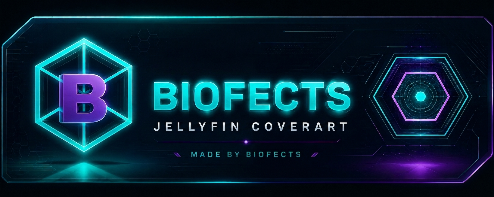

<p align="center">
	
</p>

<h1 align="center">Jellyfin Cover Art</h1>

<p align="center">
	Format-aware photographic DVD, Blu-ray, and 4K UHD cases for Jellyfin.
</p>

<p align="center">
	<a href="https://github.com/biofects/Jellyfin-CoverArt-Plugin/releases"></a>
	<a href="https://github.com/biofects/Jellyfin-CoverArt-Plugin/actions/workflows/build.yml"></a>
	<a href="LICENSE"></a>
</p>

A clean-room Jellyfin 10.11 plugin that wraps portrait artwork in a case matching
the media resolution. Source posters remain unchanged.

This project is inspired by the workflow of Emby's CoverArt plugin, but it does
not include or derive from the proprietary plugin's code, artwork, fonts, or
registration system. The renderer and included visual assets are independently
created for this project.

## Features

- Per-media-type case-cover toggles for movies, series, seasons, episodes, albums, and collections
- Embedded photographic DVD, Blu-ray, and 4K UHD case overlays
- Transparent case silhouettes and poster apertures
- Poster artwork perspective-mapped beneath each case frame
- Safe image-response interception with fallback to Jellyfin's original image
- Jellyfin dashboard configuration page
- Primary artwork processing; thumbnails and backdrops remain untouched
- Portrait artwork only; horizontal and square home-page tiles remain untouched
- Source- and configuration-aware disk caching with HTTP ETag support

Case selection uses the best available video stream resolution:

| Resolution | Case |
| --- | --- |
| SD, 480p, 720p | DVD |
| 1080p, 1440p | Blu-ray |
| 4K, 8K | 4K UHD |

## Requirements

- Jellyfin Server 10.11.x
- A server platform supported by Jellyfin's bundled SkiaSharp runtime

## Install a Test Release

1. Download `Jellyfin.Plugin.CoverArt-v1.0.0.zip` from the
	[v1.0.0 release](https://github.com/biofects/Jellyfin-CoverArt-Plugin/releases/tag/v1.0.0).
2. Extract it into `<jellyfin-config>/plugins/Cover Art_1.0.0.0`.
3. Restart Jellyfin.
4. Open **Dashboard > Plugins > Cover Art** and choose which media types use cases.

To upgrade or troubleshoot an image that was already loaded, restart Jellyfin
after replacing the plugin and hard-refresh the browser. Do not run another
plugin that intercepts the same image responses at the same time.

## Build from Source

The plugin targets .NET 9 and Jellyfin 10.11.

```bash
dotnet build Jellyfin.Plugin.CoverArt/Jellyfin.Plugin.CoverArt.csproj -c Release
dotnet test Jellyfin.Plugin.CoverArt.slnx -c Release
```

The compiled plugin is
`Jellyfin.Plugin.CoverArt/bin/Release/net9.0/Jellyfin.Plugin.CoverArt.dll`.
Generated binaries and packages are intentionally excluded from this repository.

## Testing and Feedback

Please include the Jellyfin version, host OS or container image, affected media
type, source image orientation, and server logs when
[reporting a bug](https://github.com/biofects/Jellyfin-CoverArt-Plugin/issues/new?template=bug_report.yml).
Security issues must be reported privately as described in [SECURITY.md](SECURITY.md).

## Clean-room Design

Jellyfin image middleware conventions were verified against the public
[Jellyfin Quality Overlay](https://github.com/obxidion/Jellyfin-Quality-Overlay)
project. Cover Art's case renderer, configuration model, metadata resolver, and
cache implementation are independently written, and no Emby CoverArt code or
assets are included.

## License and Disclaimer

Released under the [MIT License](LICENSE). This independent community plugin is
not affiliated with, endorsed by, or maintained by the Jellyfin project.